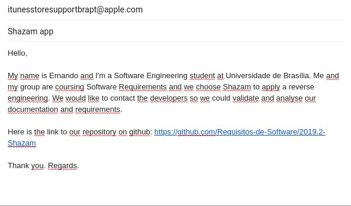

# E-mail ao suporte

## Método utilizado

Para validação, o grupo optou inicialmente por enviar um e-mail ao suporte do Shazam, o qual a Appe Inc. é responsável. 

Segue abaixo o e-mail enviado. Até o presente momento não obtivemos retorno.

## Versionamento

|Data|Versão|Alteração|Responsável(eis)|
|:--:|:----:|:-------:|:---:|
|04/11/2019|1.0|Criação do documento|Débora Vilela|
|05/11/2019|1.1|Adicionando versionamento|Débora Vilela|
