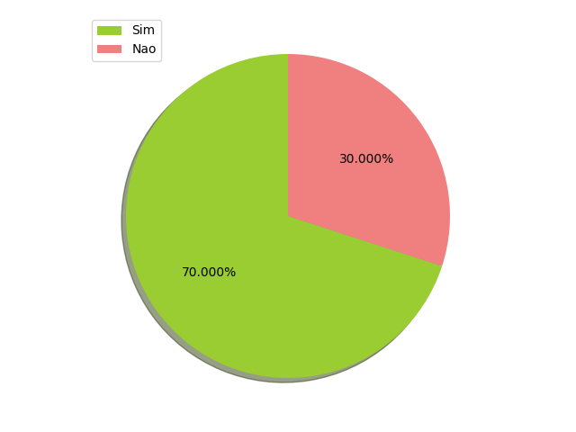
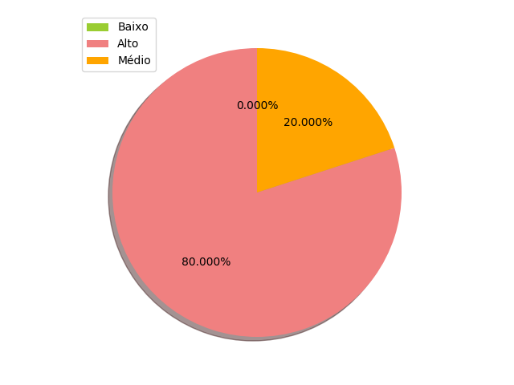

# Verificação de Léxicos 

## Planejamento

Para a verificação dos léxicos, foi utilizado o método de verificação pelo ponto de vista, de forma a detectar qualquer divergência em relação à estrutura padrão de um léxico. O documento presente foi realizado por dois integrantes da equipe.

## Visão geral

Para a verificação dos léxicos, foi utilizado o método de checklist de forma a deixar objetivo e organizado cada tópico analisado.

O método de checklist funciona desta forma: 

## Rastreabilidade

Inicialmente, pelo fato dos léxicos não possuírem identificação singular, todos estão contidos em um único rastro, conforme consta no documento Léxicos no tópico [Modelagem](https://requisitos-de-software.github.io/2019.2-Shazam/modelagem/lexicos/).

## Etapas da verificação

### Checklist

Foram levantadas questões as quais expressam a finalidade e a execução de cada item de um léxico.

|Número|Questão|
|:---:|:---:|
|1 |O léxico contém um termo?|
|2 |O documento possui versionamento?|
|3 |O léxico contém uma ou mais noções?|
|4 |O léxico contém um ou mais impactos?|
|5 |O léxico está rastreado?|
|6 |A noção possui uma definição similar a de um dicionário?|
|7 |O sujeito, quando classificado como um verbo, tem descrita na noção:quem realiza;quando acontece;quais os procedimentos envolvidos;|
|8 |O sujeito, quando classificado como um verbo, deve possuir em seu impacto:quais os reflexos da ação no ambiente;|
|9 |O sujeito, quando classificado como um objeto, deve possui descrito em sua noção: a definição do objeto; a identificação de outros objetos os quais é relacionado;|
|10|O sujeito, quando classificado como um objeto, deve possuir descrito em seu impacto: ações que podem ser aplicados ao seu objeto;|
|11|Os léxicos estão identificados por uma nomenclatura padrão ou enumerados? |  
|12|O léxico possui sinônimo?|

### Resultados

|Questão|Atende|Atende parcialmente|Não atende|Impacto|Motivo|
|:--:|:----:|:---:|:---:|:---:|:---:|
|O léxico contém um termo?|Todos os léxicos atendem|||Alto||
|O documento possui versionamento?|Todos os léxicos atendem|||Alto||
|O léxico contém uma ou mais noções?|Todos os léxicos atendem|||Alto||
|O léxico contém um ou mais impactos?|Todos os léxicos atendem|||Alto||
|O léxico está rastreado?|||Nenhum léxico atende|Alto|Nenhum documento foi rastreado até o presente momento|
|A noção possui uma definição similar a de um dicionário?|Mídia, Login, Top-trending,Shazam||Identificar,Compartilhar,Biblioteca,Descobrir,Abrir|Alto|Há a explicação da noção, mas não condiz com o dicionário|
|O sujeito, quando classificado como um verbo, tem descrita na noção:|Todos os classificados como verbo atendem|||Moderado||
|O sujeito, quando classificado como um objeto, deve possuir descrito em seu impacto:|Todos os classificados como objeto atendem|||Moderado||
|Os léxicos estão identificados por uma nomenclatura padrão ou enumerados? |||Nenhum dos léxicos atende|Alto|Foram identificados apenas pelo sujeito|
|O léxico possui sinônimo?|Todos os léxicos atendem|||Alto||

#### Visualização de Resultados

### Critério de qualidade

1 item reprovado - Qualidade Alta
2 itens reprovados -Qualidade Média
3 itens ou mais reprovados - Qualidade Baixa

|Léxico|Quantidade de itens reprovados|Qualidade Baixa|Qualidade Média| Qualidade Alta|Critérios não atendidos|
|:--:|:----:|:-------:|:---:|:---:|:---:|
|Identificar|3|X|||5,6,11|
|Mídia|2||X||5,11|
|Compartilhar|3|X|||5,6,11|
|Biblioteca|3|X|||5,6,11|
|Login|2||X||5,11|
|Top-trending|2||X||5,11|
|Descobrir|3|X|||5,6,11|
|Abrir|3|X|||5,6,11|
|Shazam|2||X||5,11|

##Correção

|Responsável|Léxico|Versão|
|:--:|:----:|:---:|

## Acompanhamento

|Léxico|Questão|Impacto|
|:--:|:----:|:---:|

## Versionamento

|Data|Versão|Alteração|Responsável(eis)|
|:--:|:----:|:-------:|:---:|
|04/11/2019|1.0|Criação do documento|Débora Vilela| 
|05/11/2019|1.1|Adição de Gráficos para melhor visualização| Gabriel Tiveron |

## Referências

* SERRANO, Maurício; SERRANO, Milene. Requisitos - Aula 4. 1º/2019. 37 slides. Material apresentado para a disciplina de Requisitos de Software no curso de Engenharia de Software da UnB, FGA.
